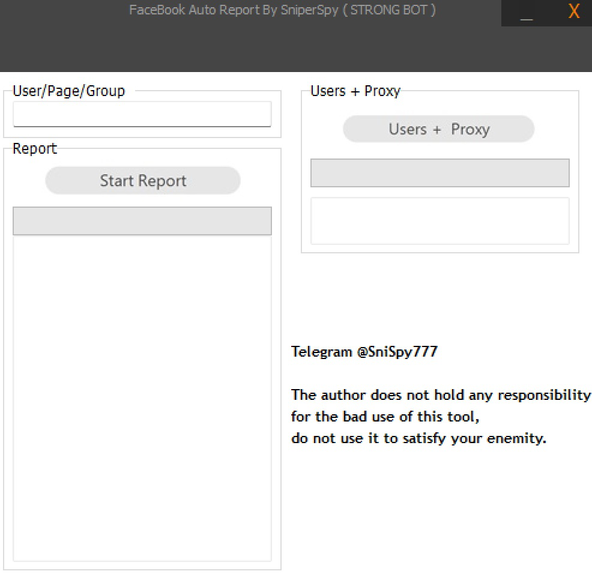

# facebook-reporting-bot

<h2 align="center">Telegram: <a href="https://t.me/masrepfb">https://t.me/masrepfb</a></h2>
What Is a Facebook Reporting Bot / Automation Tool? ❓

A Facebook reporting bot or automation tool is software designed to simplify and organize the process of submitting reports concerning accounts, pages, profiles, or content that may violate Facebook's Terms, Community Standards, or other platform policies.

Instead of manually navigating through multiple reporting screens, an automation system can assist with repetitive, legitimate reporting tasks while keeping the reporting process structured and consistent.

How Does the Reporting System Work? ❓

A typical reporting workflow can contain several stages:

• 1. Target identification — the user specifies the profile, page, post, or other content that needs to be reviewed.
• 2. Category selection — the appropriate potential violation category is selected, such as impersonation, spam, harassment, fraudulent behavior, or another applicable policy issue.
• 3. Report preparation — the system organizes the relevant information required for the report.
• 4. Submission assistance — the tool can automate or simplify repetitive parts of the reporting workflow where permitted.
• 5. Platform review — Facebook receives the report and evaluates it through its own moderation and enforcement systems.
• 6. Result tracking — where information is made available by Facebook, the user can monitor the status or outcome of submitted reports.
<h2>What Is the Algorithm Behind It? ⚙️</h2>

A legitimate reporting automation system can be structured around a simple decision workflow:

<pre>
Input
  ↓
Target / Content Identification
  ↓
Policy Category Selection
  ↓
Report Information Validation
  ↓
Report Submission
  ↓
Facebook Moderation Systems
  ↓
Review / Decision
  ↓
Status Tracking
</pre>

The important distinction is that an automation tool can assist with submitting a report, but it legitimately guarantee that an account will be removed. The final decision belongs to Facebook and depends on its policies, evidence, and moderation systems.

What Can the Tool Be Used For? 🔎

Depending on the implementation, a reporting assistant may help users organize reports concerning:
• Fake or impersonating profiles
• Spam and unwanted content
• Harassment or abusive behavior
• Fraudulent activity
• Misleading or deceptive accounts
• Content that potentially violates Facebook Community Standards
• Other legitimate policy violations
Can a Reporting Bot Guarantee an Account Ban? ❌

legitimate reporting tool can guarantee that a Facebook account, page, or post will be removed. Submitting multiple reports does not automatically establish that a violation occurred, and Facebook ultimately determines whether enforcement action is appropriate.

  

How Can I Get the Tool or Submit a Report? 📩
  

• Join our Telegram channel: https://t.me/masrepfb
  

• Review the available information and demonstrations.
      

• Contact us through the Telegram username provided with the relevant service.

⸻⸻⸻⸻⸻⸻⸻⸻⸻⸻⸻⸻⸻⸻

Legal Notice ⚠️

This tool is intended only for legitimate reporting and moderation-related purposes. Users must provide truthful information and comply with Facebook’s Terms of Service, Community Standards, and applicable laws.
Users are solely responsible for the reports they submit and for ensuring that their use of the service does not constitute harassment, abuse, spam, or manipulation of Facebook’s reporting systems.

==============================================
